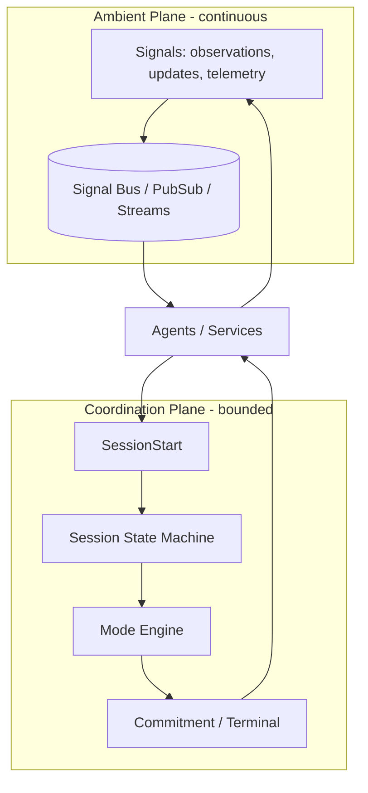
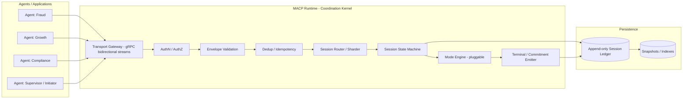
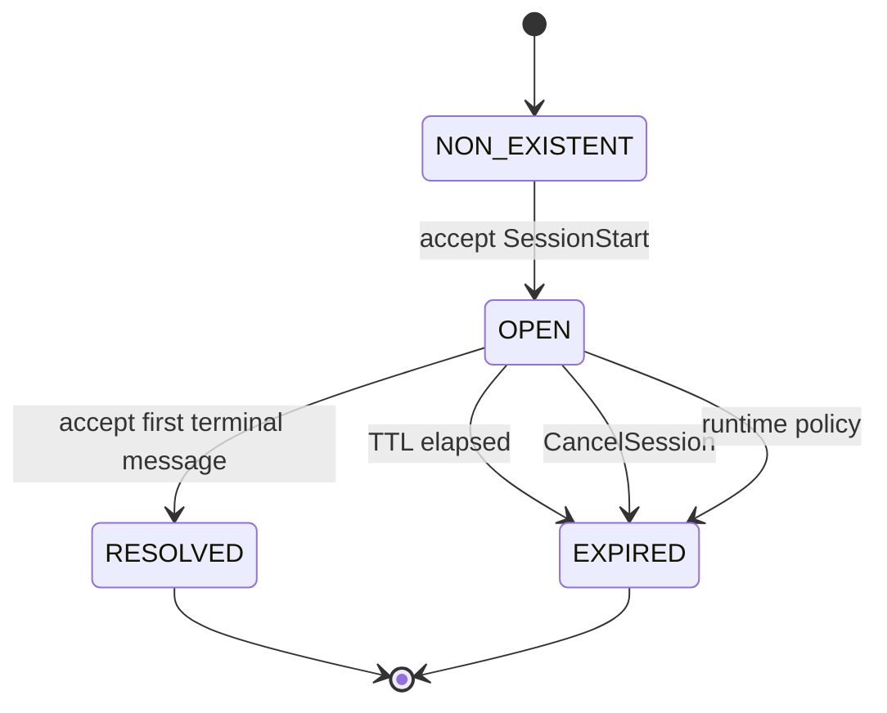
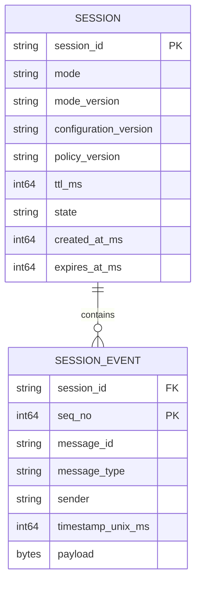
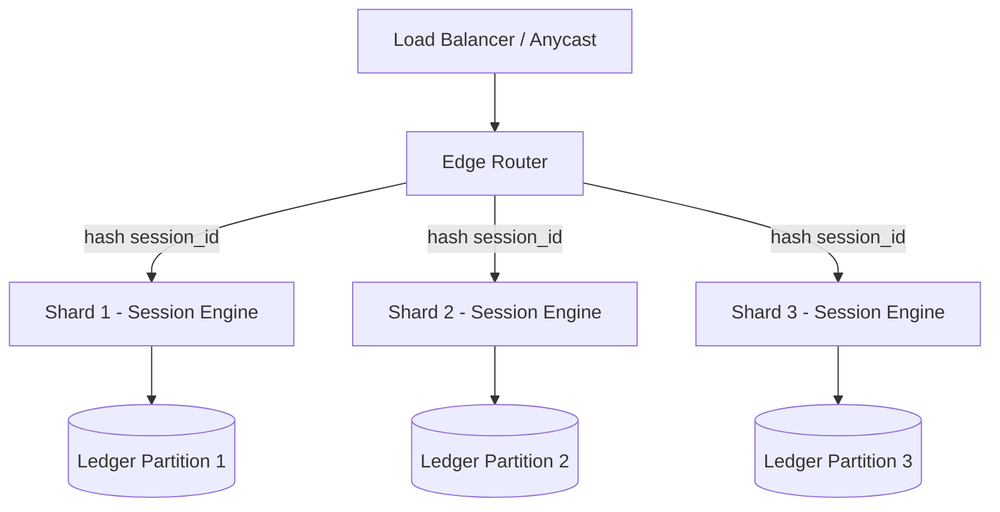
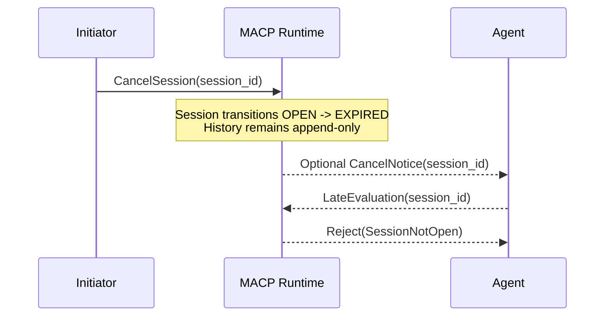

# MACP Architecture

> **Status:** Non-normative (explanatory). In case of conflict, [RFC-MACP-0001](../rfcs/RFC-MACP-0001-core.md) is authoritative.

**Protocol Revision:** 2026-03-02
**Normative transport:** gRPC over HTTP/2
**Canonical wire format:** Protocol Buffers
**Required JSON mapping:** Yes

---

## Abstract

The Multi-Agent Coordination Protocol (MACP) is a structural coordination kernel for ecosystems of autonomous agents.

It is designed for the moment modern AI systems are now entering: not the moment where a single model becomes capable, but the moment where many capable entities must reliably produce *one binding outcome*—on purpose, every time, under pressure.

MACP is built around a single invariant:

**Binding, convergent coordination MUST occur inside explicit, bounded Coordination Sessions.**

Everything else—telemetry, observation, partial reasoning, learned context, local state announcements—can remain continuous and ambient, expressed as Signals. But the phase change where many perspectives collapse into one commitment is not allowed to emerge accidentally from message timing. It must occur inside a declared boundary with enforced lifecycle, isolation, and replay integrity.

This document describes MACP’s architectural model, runtime responsibilities, scaling topology, persistence and replay design, flow-control constraints, and security posture. It is written as an architecture chapter that can be published alongside the MACP core specification.

---

## 1. Terminology

This chapter uses the following terms:

**Agent**  
An identifiable computational entity that emits and receives MACP Envelopes.

**Signal**  
An ambient, non-binding message carrying informational updates. Signals MUST NOT create sessions, mutate session state, or produce binding outcomes.

**Coordination Session**  
A bounded coordination context created only by `SessionStart`, governed by a declared Mode and a monotonic lifecycle, and terminating explicitly as **RESOLVED** or **EXPIRED**.

**MACP Runtime**  
The logical system responsible for enforcing structural invariants: validation, ordering, deduplication, session lifecycle transitions, isolation, and persistence.

**Mode (Coordination Mode)**  
A semantic extension defining how coordination unfolds within a session: message types, participant rules, arbitration semantics, termination condition(s), determinism claims, and commitment meaning. Modes operate inside MACP Core constraints.

---

## 2. The architectural model: two planes and a boundary

MACP begins with a structural separation that most multi-agent systems implicitly blur.

In a real ecosystem, agents continuously observe the world, update models, publish telemetry, refine context, and emit partial evaluations. That flow has no natural end. It is ambient intelligence—the system breathing.

But the ecosystem also repeatedly reaches moments where it must act: allocate a resource, approve a transaction, select a plan, execute a tool, accept a constraint, or deny an action. Those moments are convergent. They are not “more messages.” They are the phase change where many perspectives collapse into one commitment.

MACP names these planes and refuses to treat them as the same thing:

- The **Ambient Plane** carries **Signals** continuously.
- The **Coordination Plane** carries **Session-scoped messages** inside explicit **Coordination Sessions**.

The boundary between planes is not conceptual. It is executable: `SessionStart`.



The ambient plane can remain rich, noisy, and adaptive. MACP does not attempt to “control” it. MACP only insists that binding convergence is not permitted to emerge implicitly from ambient interaction.

---

## 3. Design philosophy: structure without semantics

MACP’s durability depends on a strict separation:

**MACP Core defines structure. Modes define meaning.**

MACP Core enforces boundaries: what constitutes a session, when coordination begins, when it ends, how history is recorded, and what replay must reproduce. It does not encode decision theory, policy, arbitration mathematics, or domain logic.

Modes are free to evolve: weighted arbitration, quorum voting, hierarchical delegation, negotiation, auctions, economic bidding. MACP does not choose among these. It ensures that any such semantics, if they become binding, are expressed inside a session with enforceable lifecycle and replay integrity.

This is why MACP is described as a **coordination kernel** rather than an orchestrator. Orchestrators tend to hardcode meaning. Kernels hardcode boundaries.

---

## 4. Core runtime components

A MACP deployment may be centralized or distributed, but a compliant runtime always implements the same logical pipeline.

Agents connect to a transport gateway. Messages are authenticated, validated, deduplicated, routed to a session owner, appended to an authoritative session log, then processed through the session lifecycle and Mode logic.



### 4.1 Transport gateway

The gateway terminates transport connections, enforces encryption, authenticates peers, and provides the runtime’s backpressure boundary.

For MACP’s normative transport (gRPC over HTTP/2), implementations SHOULD use bidirectional streaming for session-scoped coordination and MUST preserve message order within a stream as observed by the gateway.

### 4.2 Validation and envelope admission

Before a message can influence coordination, it must be admitted into the runtime.

Admission is not “processing.” Admission is the act of accepting an Envelope into the session’s append-only history.

A runtime MUST validate that:

- the Envelope is structurally valid for the declared `macp_version`,
- the sender identity matches authentication context,
- if `session_id` is non-empty, the referenced session exists and is OPEN,
- `message_id` has not already been accepted within the session (deduplication),
- the sender is authorized to participate per session policy / Mode rules.

If any of these checks fails, the runtime MUST reject the message and MUST NOT create side effects.

### 4.3 Session ownership and routing

A runtime MUST define an authoritative owner for each OPEN session, responsible for ordering and lifecycle transitions.

In a distributed deployment, the standard approach is to shard by `session_id`. Session ownership may migrate via leases during failover, but at any moment there MUST be exactly one ordering authority per session.

---

## 5. Message model: the Envelope as structural spine

Every MACP message is encapsulated in an Envelope. The Envelope exists to keep coordination transport-independent, replayable, and versioned.

The canonical representation is Protocol Buffers; a JSON mapping is required for interoperability.

```protobuf
syntax = "proto3";

package macp.v1;

message Envelope {
  string macp_version = 1;
  string mode = 2;
  string message_type = 3;
  string message_id = 4;
  string session_id = 5;          // empty for Signals
  string sender = 6;
  int64  timestamp_unix_ms = 7;   // informational
  bytes  payload = 8;             // mode-defined
}
```

### 5.1 Structural vs semantic validation

MACP Core validates the Envelope as a structural container.

Modes validate the payload as semantic content.

This division is essential: the runtime must be able to enforce boundaries without understanding domain logic.

### 5.2 Core message categories

MACP defines two primary categories of messages:

**Signals (ambient)**  
Signals MUST have an empty `session_id` (or a session correlation field inside the payload, depending on the mapping). Signals MUST NOT mutate session state.

**Session-scoped messages (coordinated)**  
Session-scoped messages MUST include `session_id` and MUST be admitted only if the session exists and is OPEN.

Modes define additional message types inside sessions, but the session boundary remains invariant.

---

## 6. Session model: when coordination becomes real

A Coordination Session is not an implementation artifact. It is the kernel boundary that makes convergence legible.

A session is created only by a valid `SessionStart` message. There is no implicit coordination.

Once created, a session is governed by a monotonic lifecycle:

- It starts OPEN.
- It terminates as RESOLVED (Mode-defined terminal condition) or EXPIRED (TTL/cancellation/policy).
- It can never return to OPEN.

### 6.1 Session-scoped communication rule

When a session is OPEN, compliant participants MUST NOT bypass MACP to advance binding outcomes.

Participants MAY communicate out-of-band for ambient reasoning or side-channel coordination, but any such communication MUST be treated as non-binding unless it is reintroduced into the session as a valid, accepted Envelope.

The point of this rule is not control. It is replay integrity. If the binding outcome can be influenced by messages the runtime never saw, replay becomes narrative reconstruction rather than deterministic verification.

---

## 7. Lifecycle enforcement: monotonic state machine

A MACP session lifecycle is a monotonic state machine. Monotonicity is the simplest way to prevent “zombie coordination” and hidden authority drift.



### 7.1 Acceptance rules in OPEN

For any Envelope with a non-empty `session_id`, the runtime MUST enforce:

1. the session exists,
2. the session is OPEN,
3. the sender is authorized,
4. the Envelope is structurally valid,
5. the Envelope is not a duplicate within that session.

If any check fails, the runtime MUST reject the Envelope and MUST NOT create side effects.

### 7.2 Duplicate SessionStart handling

The runtime MUST prevent session ambiguity:

- If the same `message_id` is received again for a previously accepted SessionStart, it MUST be treated as an idempotent duplicate and MUST NOT create a second session.
- If the same `session_id` is reused with a different `message_id`, the runtime MUST reject it.

### 7.3 Terminal races

If multiple terminal messages arrive concurrently, the runtime MUST define the session’s outcome as the first terminal message accepted into the append-only log. All later terminal messages MUST be rejected because the session is no longer OPEN.

### 7.4 Expiration semantics

Every session MUST have a finite TTL. Unbounded sessions are not permitted.

When TTL elapses, the session MUST transition to EXPIRED deterministically based on the runtime clock. Messages received after expiration MUST be rejected and MUST NOT retroactively alter session state.

---

## 8. Ordering, delivery, and idempotency

### 8.1 The authoritative order is acceptance order

Within a session, ordering MUST be preserved.

In a distributed system with multiple senders, this cannot mean “sender order.” It must mean **runtime acceptance order**: the order in which the session owner admits Envelopes into the session log.

This defines a total order per session that is:

- durable (because it is persisted),
- replayable (because the same sequence can be applied),
- independent of sender timing quirks.

Cross-session ordering is not guaranteed and MUST NOT be relied upon.

### 8.2 At-least-once delivery and deduplication

MACP assumes at-least-once delivery at the transport layer. This is a realism constraint, not a preference.

Therefore, the runtime MUST enforce idempotency using `message_id`:

- If an Envelope with a previously accepted `message_id` is received within the same session, it MUST be treated as a duplicate and MUST NOT produce side effects.
- The runtime SHOULD return an Ack that indicates duplication rather than treating it as an error, to simplify client retry behavior.

### 8.3 Idempotency boundaries

Idempotency must exist at two levels:

- **Core idempotency:** `message_id` deduplication prevents duplicated session events.
- **Semantic idempotency:** Modes MUST define how duplicate semantic actions are handled when the external world is involved (e.g., tool execution).

The core can guarantee the first. The mode must address the second.

---

## 9. Persistence and replay: the session ledger as truth

A coordination kernel that cannot replay is not a kernel. It is just runtime behavior with logs.

MACP achieves replay integrity by treating accepted session history as an append-only ledger.

### 9.1 Append-only session log

For each session, the runtime MUST persist an ordered list of accepted Envelopes. This log is immutable once written.

A practical implementation uses event sourcing:

- each accepted Envelope is assigned a monotonic `seq_no` within the session,
- session state is derived from replaying events in `seq_no` order,
- optional snapshots accelerate reads.



### 9.2 Structural determinism guarantee

MACP Core guarantees **structural replay integrity**:

Replaying the same accepted Envelope sequence under the same:

- `macp_version`,
- Mode identifier and Mode version,
- configuration version(s),

MUST reproduce the same **state transitions** and the same terminal lifecycle outcome (RESOLVED vs EXPIRED).

MACP Core does not guarantee semantic determinism unless the Mode claims it.

### 9.3 Binding versions at session start

A session is replayable only if its execution context is historically exact.

Therefore, sessions SHOULD bind:

- `mode_version`,
- `configuration_version`,
- and, when applicable, `policy_version`

as immutable session metadata. These values MUST NOT change within an OPEN session.

If policies evolve over time, they evolve between sessions, not within one.

### 9.4 Mode-level determinism claims

Modes MAY claim stronger guarantees beyond MACP Core. When they do, they SHOULD declare:

- whether semantic outcomes are deterministic,
- what inputs are considered part of the determinism boundary,
- what sources of nondeterminism are excluded.

A voting mode with a fixed quorum threshold can be fully deterministic. A mode that calls external APIs in real time may not be.

### 9.5 External side effects: keeping replay honest

Replay fails most often at the boundary where coordination causes side effects.

MACP encourages a clean separation: coordination sessions should produce **Commitments**, and side effects should be executed in a way that is either:

- deferred and idempotent, or
- logged as part of the session history.

Practical patterns include:

- emitting a Commitment containing a tool execution plan rather than executing tools during coordination,
- making external tools idempotent via transaction IDs,
- logging external results as session messages so replay can use recorded outputs rather than calling the external world again.

If a Mode claims semantic determinism while also performing external I/O without logging results, that claim is not credible.

### 9.6 Optional cryptographic verification

For high-assurance deployments, implementations MAY add cryptographic integrity:

- Envelopes may be signed by senders.
- The session log may form a hash chain.
- The final session state may include a session hash committed alongside the terminal message.

These mechanisms strengthen tamper evidence without changing MACP Core invariants.

---

## 10. Routing and scaling: sessions as the sharding key

MACP scales by treating the session as the unit of ordering.

The fundamental scaling rule is:

**At any moment, there MUST be exactly one authoritative ordering authority per OPEN session.**

Distributed runtimes typically implement this by hashing `session_id` to shards. Each shard owns ordering and lifecycle for the sessions it hosts.



### 10.1 Failover and ownership transfer

When shards fail, session ownership must transfer without producing split-brain ordering.

A common approach is a lease per shard partition (or per session) plus replay-based recovery:

- on takeover, the new owner rehydrates session state from the append-only log,
- then resumes admission with monotonic sequencing.

The transfer mechanism is implementation-defined, but the invariant remains: only one ordering authority may accept messages for a session at a time.

### 10.2 Cross-session references

MACP does not guarantee cross-session ordering, and Modes MUST NOT rely on it.

If a Mode requires cross-session coordination, it MUST define that topology explicitly (e.g., a parent session that commits child sessions), and the runtime MUST still preserve isolation boundaries unless an explicit extension is defined.

---

## 11. Flow control and resource limits: backpressure as coherence

A coordination kernel that buffers unboundedly becomes the instability it was built to prevent.

Therefore, implementations MUST treat flow control and resource limits as structural features, not tuning knobs.

### 11.1 Backpressure

For the normative gRPC streaming transport, the runtime SHOULD use HTTP/2 flow control to propagate backpressure to senders rather than buffering indefinitely.

### 11.2 Payload size limits

Implementations MUST define and enforce maximum payload sizes consistently. Oversized messages MUST be rejected deterministically.

### 11.3 Session quotas

Runtimes SHOULD enforce:

- maximum concurrent OPEN sessions per agent,
- maximum participant count per session,
- maximum in-flight messages per session,
- per-agent rate limits for SessionStart.

These are not merely operational concerns. They are DoS mitigations and determinism preservers.

### 11.4 TTL as boundedness guarantee

TTL is not an optional convenience. It is the protocol’s guarantee that coordination cannot remain open forever.

A system that can never force a session to terminate cannot guarantee coherence under pressure.

---

## 12. Cancellation: structural termination, not polite suggestion

Cancellation is where many systems degrade into ambiguity. MACP treats cancellation as structural.

A compliant runtime MUST support deterministic cancellation that transitions a session from OPEN to EXPIRED without mutating history.

A runtime SHOULD emit a session-scoped cancellation event (`SessionCancel` Envelope) into the append-only log so that replay preserves the cause of termination.



Cancellation must be idempotent per session. Repeated cancel requests MUST not create inconsistent states.

---

## 13. Modes: semantics inside a stable boundary

Modes exist because coordination semantics will differ across domains and evolve over time.

MACP Core therefore provides a stable boundary and requires that Modes declare their behavior explicitly.

A Mode specification SHOULD define:

- its identifier and version,
- the message types it accepts,
- participant rules,
- termination semantics (what ends the session),
- determinism claims,
- payload schemas (Protobuf and/or JSON Schema),
- security and privacy considerations.

Modes MUST NOT violate MACP Core invariants: session isolation, append-only history, monotonic lifecycle.

### 13.1 A Mode is a contract, not a code module

A Mode is a protocol surface. Even if implemented as a library, its true form is an externally visible contract: “If you send these message types in these phases, the session will converge like this.”

This is why Modes should publish descriptors that are machine-readable and stable.

### 13.2 Mode patterns that map cleanly to MACP

Many coordination patterns become clean when expressed as sessions:

- orchestrator-led decision: collect proposals → collect votes → commit,
- quorum approvals: N-of-M approvals required,
- negotiation: proposals and counterproposals until consensus,
- auctions: bids → close → select winner,
- delegated evaluation: specialists submit assessments → initiator commits.

These patterns differ semantically, but share structural needs: explicit start, bounded life, terminal outcome, replayable history.

---

## 14. Integration: tools, prompts, and external capability layers

MACP is not a tool protocol. It is a coordination boundary.

But agent ecosystems increasingly rely on external capability surfaces such as tool invocation, retrieval, and prompt templates. MACP is designed to coordinate *when and how* these capabilities may be used.

A common pattern is:

- MCP (or similar) exposes **tools**, **resources**, and **prompts**.
- MACP sessions coordinate whether invoking a tool is permitted, required, deferred, or denied.
- The session produces a Commitment that either authorizes an invocation or produces a plan.

This split keeps MACP coherent: it coordinates commitments, not ad-hoc effects.

Modes that coordinate tool execution SHOULD treat tool calls as side effects and apply one of the replay-safe patterns described in §9.5.

---

## 15. Security architecture: boundaries must be defended

Security is not optional for a coordination kernel because the kernel is where authority collapses.

A compliant MACP deployment MUST enforce:

- encrypted transport,
- authenticated agents,
- session-level authorization,
- replay protection via deduplication,
- isolation against cross-session injection,
- resource exhaustion defenses.

### 15.1 Transport security

All MACP deployments MUST use encrypted transport. For gRPC, TLS is required.

### 15.2 Authentication

Implementations MUST support at least one authentication mechanism suitable for machine-to-machine coordination (e.g., mTLS or JWT-based identity). The `sender` field MUST be derived from authenticated identity.

### 15.3 Authorization

Before processing any session-scoped message, the runtime MUST verify that the sender is authorized for that session according to Mode rules and deployment policy.

SessionStart SHOULD be subject to admission control, including rate limits and mode authorization.

### 15.4 Replay protection

`message_id` deduplication is both an idempotency mechanism and a replay-attack mitigation.

Session IDs MUST be cryptographically strong and unguessable.

### 15.5 DoS mitigation

The runtime SHOULD enforce quotas and rate limits to prevent SessionStart flooding, payload amplification, and unbounded buffering.

---

## 16. Observability: coordination must be legible

MACP’s purpose is not merely to coordinate, but to make coordination visible.

Implementations SHOULD support:

- audit logs: session creation, termination, commitment emission, rejections,
- structured errors: with stable codes and optional session context,
- tracing: correlation IDs propagated without compromising isolation,
- metrics: session rates, latency, rejection counts, dedup hits, expiration counts.

Replay is the ultimate observability feature: it turns debugging into reading.

---

## 17. Deployment topologies

MACP is compatible with multiple deployment shapes:

A single runtime can host sessions for a single application. A shared runtime can coordinate a fleet of agents. A federated design can route sessions across organizational boundaries. These are deployment decisions; the kernel invariant stays the same.

The protocol remains transport-independent at the architecture level, but the normative transport provides a shared baseline for interoperability.

---

## 18. Implementation considerations: how kernels fail in practice

Most coordination kernels do not fail because their “main idea” is wrong. They fail in the seams.

This section describes the seams that matter.

### 18.1 Make admission a single, transactional step

Treat “accepting a message” as one atomic act: validate → dedup → append to log with a sequence number. Everything else is downstream.

If admission and persistence are separated, replay integrity becomes fragile because the “truth” can diverge from what the runtime believed.

### 18.2 Define what is durable, and when

The runtime should make a clear promise about durability:

- when an Ack is returned, the message is durably in the session log,
- if the runtime crashes after Ack, replay will reconstruct that accepted message.

If a runtime returns Ack before persistence, then the client’s retry semantics will create ambiguity.

### 18.3 Keep Mode execution replayable

If a Mode claims determinism, it should operate as a pure function over accepted session history and bound versions. Any dependency on wall-clock time, randomness, iteration order of unordered collections, or external I/O without logging becomes a replay trap.

### 18.4 Use snapshots carefully

Snapshots accelerate reads but can silently poison replay if treated as truth. A correct snapshot is a cached derivative of the log, not an authority. Always be able to rehydrate from the append-only history.

### 18.5 Test the kernel like a database

A coordination runtime should be tested like a database:

- replay tests: accepted history reproduces state transitions,
- fuzz tests: random message sequences do not violate invariants,
- race tests: terminal races resolve deterministically,
- load tests: backpressure works and buffers remain bounded,
- fault injection: shard failover rehydrates correctly without split-brain.

### 18.6 Treat “out-of-band coordination” as hostile to replay

The session-scoped communication rule exists because humans and systems will always be tempted to “just call the other agent” when a session is stuck.

If a system allows binding influence to travel outside the session boundary, the kernel becomes a façade. The most important discipline is not in code; it is in architecture enforcement.

---

## 19. Summary

MACP’s architecture is the architecture of a boundary.

It preserves the richness of ambient, continuous intelligence, but insists that convergence—the moment the system commits—happens inside an explicit session with enforceable lifecycle, isolation, and replay integrity.

That is what allows autonomy to scale without becoming opacity.

In the Coordination Age, the systems that endure will not be those with the most intelligence. They will be those with the most coherent structure.
