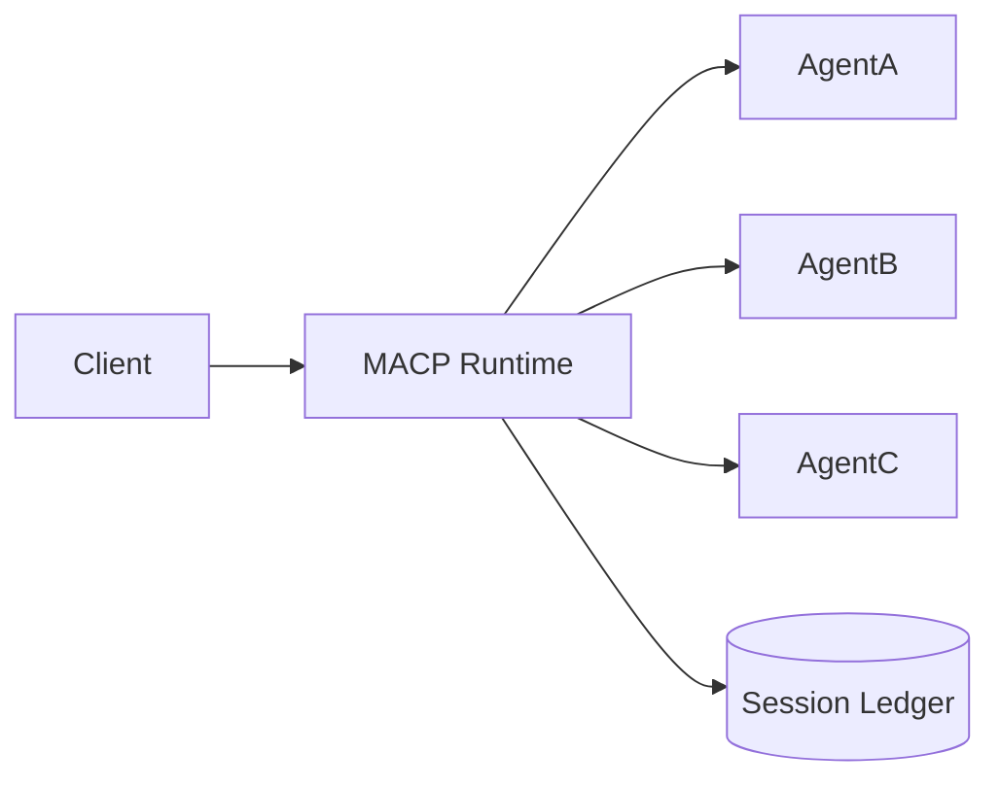
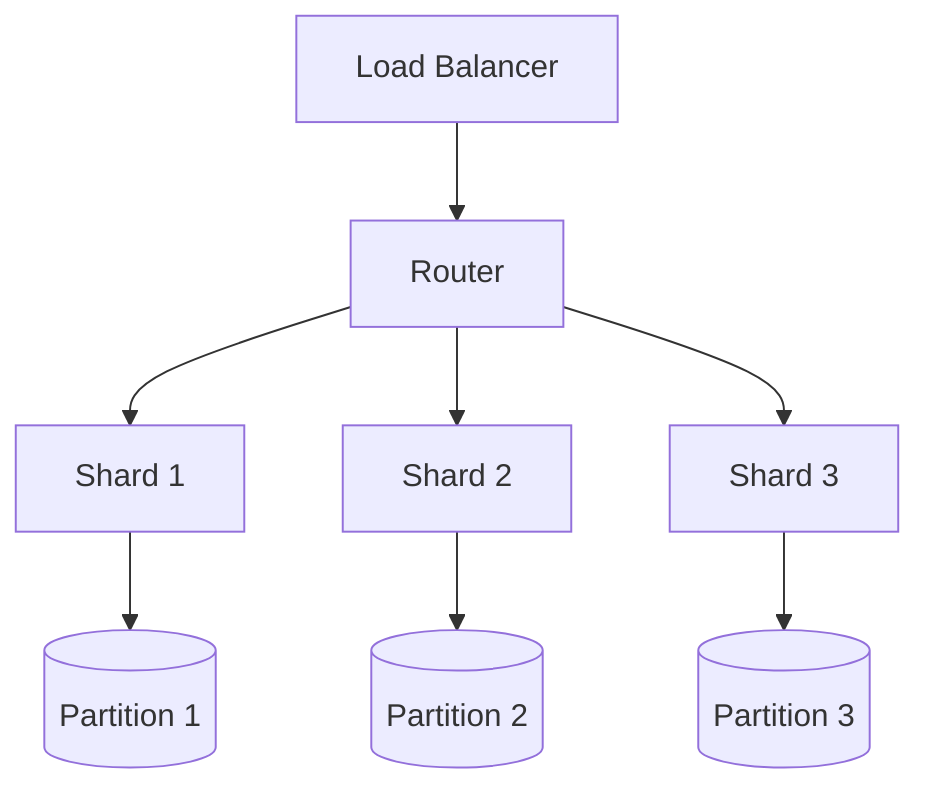
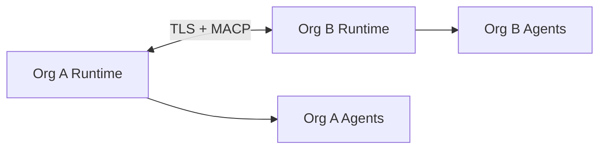

# MACP Deployment Topologies

> **Status:** Non-normative (explanatory). In case of conflict, the referenced RFC is authoritative.
> **Reference:** [RFC-MACP-0001 Core](../rfcs/RFC-MACP-0001-core.md)

MACP is deployment-agnostic at the protocol level, but certain deployment shapes preserve its guarantees better than others.

## 1. Single Runtime

The simplest deployment hosts a single runtime and a small set of agents.

This topology is ideal for development, proofs of concept, or tightly controlled single-tenant systems.

## 2. Sharded Runtime

For higher throughput, sessions are partitioned by `session_id`.

The critical invariant is that a single OPEN session has exactly one owner at a time.

## 3. Federated Coordination

Federated deployments allow different organizations or trust domains to run separate runtimes while coordinating through agreed transport and manifest surfaces.

Federation works best when manifests, mode descriptors, and registries are stable and discoverable.

## 4. Operational recommendations

- keep session owners close to their ledgers,  
- propagate backpressure rather than buffering indefinitely,  
- treat registries as cacheable but versioned,  
- expose health, latency, and rejection metrics per shard.
