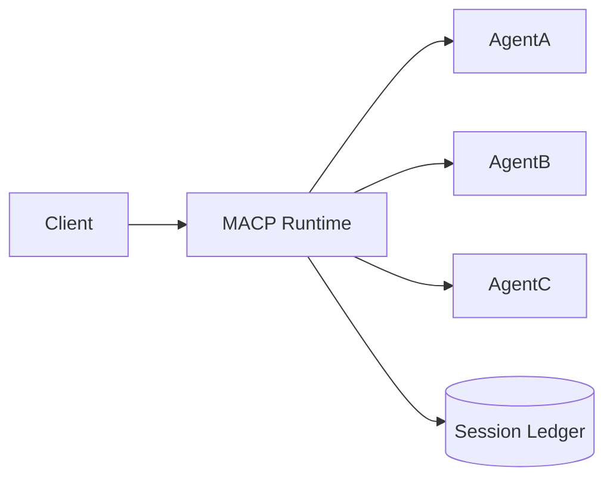
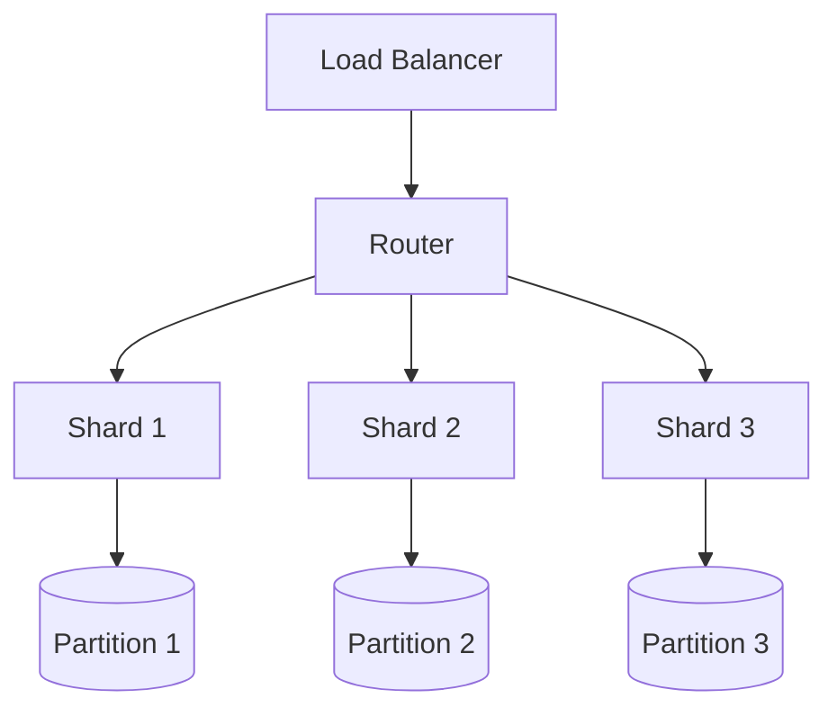
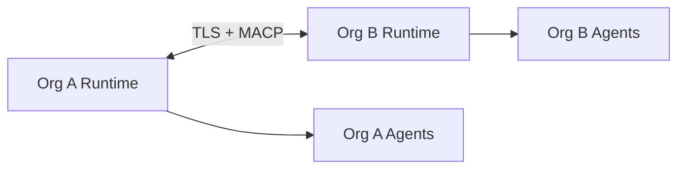

# MACP Deployment Topologies

> **Status:** Non-normative (explanatory). In case of conflict, the referenced RFC is authoritative.
> **Reference:** [RFC-MACP-0001 Core](../rfcs/RFC-MACP-0001-core.md)

MACP is deployment-agnostic at the protocol level, but certain deployment shapes preserve its guarantees better than others.

For the fuller treatment of routing, scaling, and deployment-topology invariants — including failover, ownership transfer, and cross-session isolation — see docs/architecture.md's own §10 (Routing and scaling: sessions as the sharding key) and §17 (Deployment topologies); this document is the compact three-topology reference, not a restatement.
The normative transport baseline every topology assumes is [RFC-MACP-0001 §9 (Transport Requirements)](../rfcs/RFC-MACP-0001-core.md).

## 1. Single Runtime

The simplest deployment hosts a single runtime and a small set of agents.

```mermaid
flowchart LR
  Client --> Runtime[MACP Runtime]
  Runtime --> AgentA
  Runtime --> AgentB
  Runtime --> AgentC
  Runtime --> Ledger[(Session Ledger)]
```

This topology is ideal for development, proofs of concept, or tightly controlled single-tenant systems.

## 2. Sharded Runtime

For higher throughput, sessions are partitioned by `session_id`.

```mermaid
flowchart TB
  LB[Load Balancer] --> Router[Router]
  Router --> S1[Shard 1]
  Router --> S2[Shard 2]
  Router --> S3[Shard 3]
  S1 --> L1[(Partition 1)]
  S2 --> L2[(Partition 2)]
  S3 --> L3[(Partition 3)]
```

The single-owner-per-OPEN-session invariant this topology depends on — and how failover preserves it across shards — is docs/architecture.md's own §10; it is not restated here.

## 3. Federated Coordination

Federated deployments allow different organizations or trust domains to run separate runtimes while coordinating through agreed transport and manifest surfaces.

```mermaid
flowchart LR
  A[Org A Runtime] <-->|TLS + MACP| B[Org B Runtime]
  A --> AAgents[Org A Agents]
  B --> BAgents[Org B Agents]
```

Federation depends on manifests ([docs/discovery.md](discovery.md)), mode descriptors, and [`registries/`](../registries/) being stable and discoverable across trust domains.

## 4. Operational recommendations

- keep session owners close to their ledgers,  
- propagate backpressure rather than buffering indefinitely,  
- treat registries as cacheable but versioned,  
- expose health, latency, and rejection metrics per shard.

Backpressure is normative, not advisory: see [RFC-MACP-0001 §9 (Transport Requirements)](../rfcs/RFC-MACP-0001-core.md).
docs/architecture.md's own §11 (Flow control and resource limits) covers the full backpressure and quota model this recommendation summarizes.
Treating registries as cacheable but versioned follows from [RFC-MACP-0005 §8 (Manifest Versioning)](../rfcs/RFC-MACP-0005-discovery-and-manifests.md)'s forward-compatibility requirement.
Rejection metrics support the auditability [RFC-MACP-0004 §8 (Auditability)](../rfcs/RFC-MACP-0004-security.md) expects.
