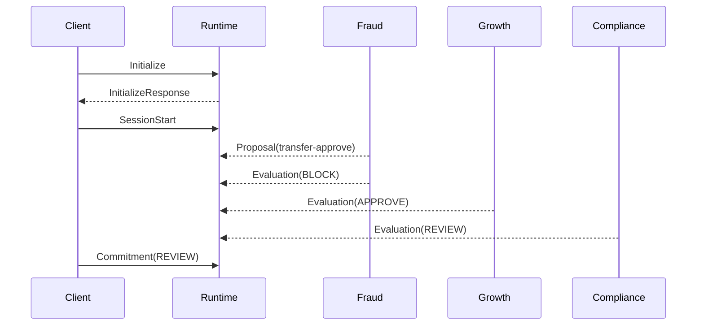

# MACP Examples

> **Status:** Non-normative (explanatory). In case of conflict, [RFC-MACP-0001](../rfcs/RFC-MACP-0001-core.md) is authoritative.

This document explains the example transcript at [`examples/json/decision-mode-session.json`](../examples/json/decision-mode-session.json).

The example shows a small Decision Mode session from initialization through Commitment. It is intentionally narrow: the purpose is to show how a bounded coordination event looks when written down as history.

## Example shape

The important property is not the specific outcome. It is that the outcome exists as a bounded transcript with a start, a lifecycle, and a terminal message.

Note that the example uses `sessions.stream: false`, consistent with unary `Send` rather than `StreamSession`.

## Reading the transcript

The example transcript is a JSON object with metadata and an ordered `messages` array. The ordering of that array is the replay order.

## What the example demonstrates

- explicit initialization and capability negotiation,
- explicit SessionStart with the orchestrator as sender (establishing designated orchestrator authority),
- a Proposal that creates a `proposal_id` before any Evaluations reference it,
- session-scoped Evaluation messages referencing the accepted proposal,
- a terminal Commitment from the designated orchestrator,
- version binding suitable for replay.
