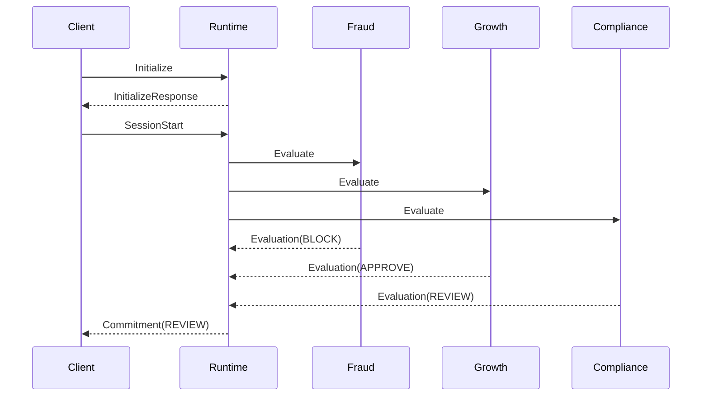

# MACP Examples

This document explains the example transcript at [`examples/decision-mode-session.json`](../examples/decision-mode-session.json).

The example shows a small Decision Mode session from initialization through Commitment. It is intentionally narrow: the purpose is to show how a bounded coordination event looks when written down as history.

## Example shape

The important property is not the specific outcome. It is that the outcome exists as a bounded transcript with a start, a lifecycle, and a terminal message.

## Reading the transcript

The example transcript is a JSON object with metadata and an ordered `messages` array. The ordering of that array is the replay order.

## What the example demonstrates

- explicit initialization and capability negotiation,  
- explicit SessionStart,  
- session-scoped evaluation messages,  
- a terminal Commitment,  
- version binding suitable for replay.
