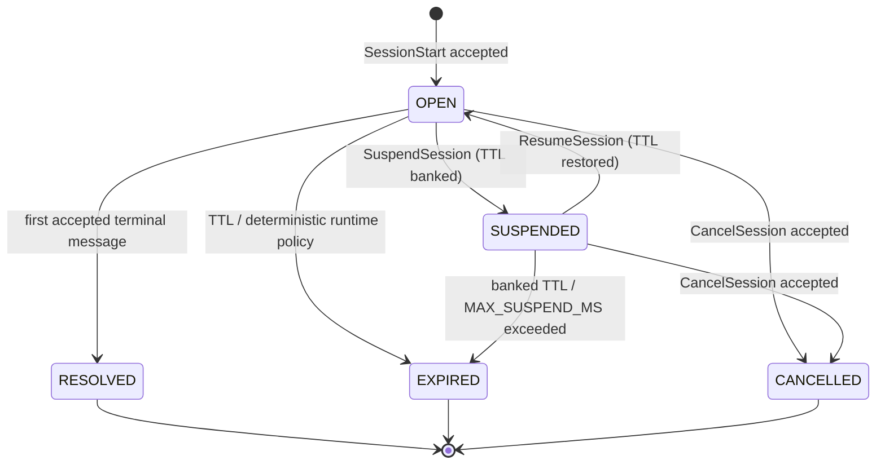

# MACP Session Lifecycle

> **Status:** Non-normative (explanatory). In case of conflict, the referenced RFC is authoritative.
> **Reference:** [RFC-MACP-0001 Core](../rfcs/RFC-MACP-0001-core.md)

The MACP session lifecycle is a monotonic state machine. This is what turns coordination from emergent behavior into enforceable protocol state.

## Session states

- **OPEN** — session is active and accepting messages
- **SUSPENDED** — non-terminal pause of an OPEN session (TTL is banked); resumes to OPEN
- **RESOLVED** — session terminated via first accepted Mode-defined terminal message
- **EXPIRED** — session terminated due to TTL or deterministic runtime policy
- **CANCELLED** — session terminated by an accepted `CancelSession` (distinct from EXPIRED)

`RESOLVED`, `EXPIRED`, and `CANCELLED` are terminal; no transition out of a terminal state is permitted. `SUSPENDED` is a non-terminal pause: only `OPEN`↔`SUSPENDED` and `SUSPENDED`→`EXPIRED` are allowed, and a commitment can only be emitted from `OPEN` (so a suspended session must be resumed before it can resolve). See [RFC-MACP-0001 §7.2/§7.5](../rfcs/RFC-MACP-0001-core.md).

## Admission rules for session-scoped messages

For any message with a non-empty `session_id`, the runtime MUST verify that:

1. the session exists,
2. the session is OPEN,
3. the sender is authorized,
4. the message is structurally valid,
5. the message is not a duplicate.

If any check fails, the message is rejected and does not enter history.

## Accepted-History Discipline

Only **accepted session-scoped** Envelopes become part of authoritative session history. Ambient Signals MAY be handled ephemerally and are not required to enter durable replay history unless a deployment opts into separate signal logging. Rejected Envelopes MUST NOT:

- be appended to accepted history,
- consume `message_id` deduplication slots,
- mutate session state.

All validation, authentication, authorization, deduplication, session-state checks, and Mode-specific structural validation MUST succeed before an Envelope is appended to accepted history.

## Cancellation Authority

The default cancellation authority is the session initiator. Deployments may extend this through policy, but cancellation always requires authentication and authorization. An accepted `CancelSession` transitions the session to the terminal **CANCELLED** state (distinct from EXPIRED) and appends a `SessionCancel` annotation to the accepted history.

## Suspension and Resume

An OPEN session can be paused and later resumed via the `SuspendSession` and `ResumeSession` control-plane RPCs (same authority model as `CancelSession`; see [RFC-MACP-0001 §7.5](../rfcs/RFC-MACP-0001-core.md)). While **SUSPENDED**, the session rejects Mode messages (it is not OPEN) and its TTL is *banked* rather than running: suspend records the remaining time, resume restores it (`SessionResumePayload.banked_ms`). A fixed `MAX_SUSPEND_MS` cap bounds indefinite pauses — exceeding it expires the session. Because suspend/resume are recorded events on the append-only history, a suspended-then-resumed session replays to the identical terminal state ([RFC-MACP-0003 §2](../rfcs/RFC-MACP-0003-determinism.md)).

## Commitment Supersession

A `CommitmentPayload` may carry a `supersedes` reference (`{session_id, commitment_hash}`) marking it as a revision of an earlier commitment. Since a RESOLVED session accepts no further messages, a superseding commitment lives in a **new** session pointing back at the prior one — supersession is inherently cross-session. The runtime only checks structural well-formedness and this-session authority; chain resolution and supersession policy are consumer governance ([RFC-MACP-0001 §7.3.1](../rfcs/RFC-MACP-0001-core.md)).

## Terminal races

If multiple terminal messages are sent concurrently, the first one accepted into the session log determines the outcome. Later terminal messages are rejected because the session is no longer OPEN.

## Session Observation

Two RPCs provide programmatic session lifecycle observation:

- **`ListSessions`** — returns `SessionMetadata` for all known sessions. Use for initial sync. Advertised by `sessions.list_sessions`.
- **`WatchSessions`** — server-streaming RPC that emits `SessionLifecycleEvent` notifications (CREATED, RESOLVED, EXPIRED, SUSPENDED, RESUMED, CANCELLED) in real time. Advertised by `sessions.watch_sessions`.

Control-planes and UIs typically call `ListSessions` on startup for a snapshot, then subscribe to `WatchSessions` for incremental updates. Events are ephemeral and not replayed.

## Session Context and Extensions

Sessions may carry optional context and extension metadata (see [RFC-MACP-0001 §7.4](../rfcs/RFC-MACP-0001-core.md)):

- **`context_id`** — an opaque string naming the structured context the session operates within (e.g., a content-addressed ID, a URI). The runtime preserves it but never interprets it.
- **`extensions`** — a map of protocol-keyed byte blocks for protocol-specific metadata (e.g., CTXM, AITP). The runtime preserves all entries but does not depend on them for core lifecycle.

Both are optional. A session with empty `context_id` and empty `extensions` behaves identically to one with both populated.

`context_id` and `extensions` are bound at `SessionStart` acceptance and are immutable for the session's lifetime. There is no post-start mutation RPC; to change them, a new session must be started.
