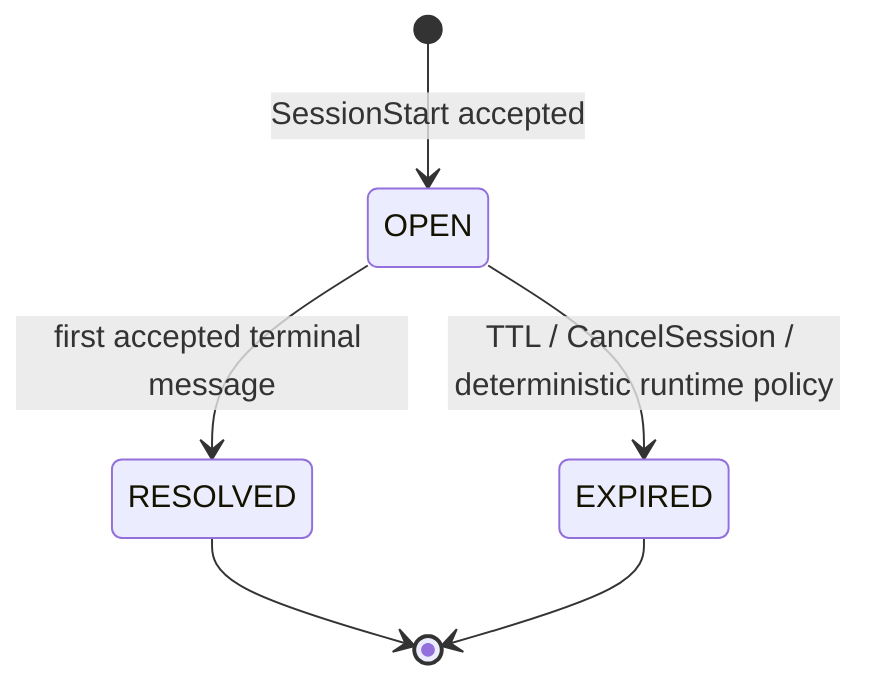

# MACP Session Lifecycle

> **Reference:** [RFC-MACP-0001 Core](../rfcs/RFC-MACP-0001-core.md)

The MACP session lifecycle is a monotonic state machine. This is what turns coordination from emergent behavior into enforceable protocol state.

## Session states

- **OPEN** — session is active and accepting messages
- **RESOLVED** — session terminated via first accepted Mode-defined terminal message
- **EXPIRED** — session terminated due to TTL, cancellation, or deterministic runtime policy

No transition from RESOLVED or EXPIRED back to OPEN is permitted.

## Admission rules for session-scoped messages

For any message with a non-empty `session_id`, the runtime MUST verify that:

1. the session exists,
2. the session is OPEN,
3. the sender is authorized,
4. the message is structurally valid,
5. the message is not a duplicate.

If any check fails, the message is rejected and does not enter history.

## Terminal races

If multiple terminal messages are sent concurrently, the first one accepted into the session log determines the outcome. Later terminal messages are rejected because the session is no longer OPEN.
