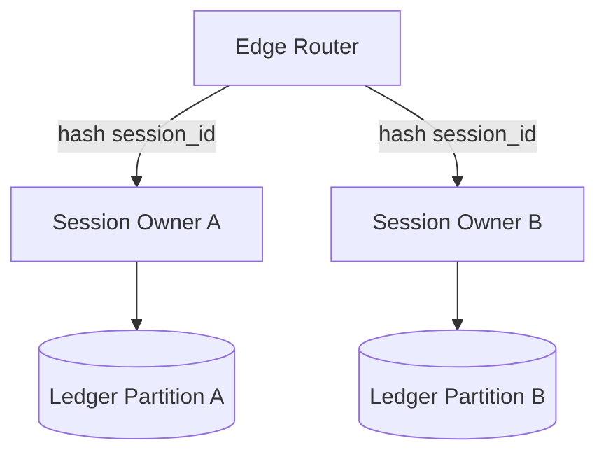

# MACP Runtime

> **Status:** Non-normative (explanatory). In case of conflict, the referenced RFC is authoritative.
> **Reference:** [RFC-MACP-0001 Core](../rfcs/RFC-MACP-0001-core.md)

A MACP Runtime is the system that turns the protocol from a specification into an enforceable boundary. Its purpose is not to decide what a session means. Its purpose is to decide, authoritatively and durably, which messages were accepted, in what order, under what lifecycle state, and by which versioned execution context.

## Runtime responsibilities

A compliant runtime performs a small number of structurally critical jobs:

1. initialize connections and negotiate capabilities,  
2. authenticate and authorize senders,  
3. validate Envelopes,  
4. assign accepted messages an authoritative order within a session,  
5. persist accepted session history append-only,  
6. execute lifecycle transitions monotonically,  
7. dispatch accepted messages to the Mode engine.

## The admission pipeline

Admission is the most important runtime act. It is the moment a message becomes part of history.

If a message is not appended, it did not happen from the protocol’s perspective.

Only **accepted** Envelopes enter history. All checks — validation, authentication, authorization, deduplication, session-state, and Mode-specific structural validation — MUST pass before the Envelope is appended. Rejected Envelopes MUST NOT consume `message_id` deduplication slots or mutate session state.

## Session ownership

Each OPEN session must have exactly one ordering authority at any instant. In a distributed deployment, this usually means sharding by `session_id` and assigning ownership through leases or partition leadership.

The owner is responsible for acceptance order, lifecycle transitions, and deterministic rejection of invalid or late messages.

## Mode execution

Mode execution SHOULD be treated as a pure function over accepted history whenever possible. The runtime does not need to understand business semantics, but it does need to know when the Mode says a terminal condition has been met.

## Recovery and rehydration

Because accepted session history is append-only, failed owners can recover by replaying the session log and reconstructing in-memory state. Snapshots are an optimization, not an authority. Ambient Signals MAY be handled ephemerally unless a deployment defines a separate signal-log profile.

## Cancellation

Cancellation transitions a session to the terminal **CANCELLED** state — distinct from EXPIRED (TTL / runtime policy) — without rewriting history. By default, only the session initiator is authorized to cancel. Deployments may extend this through policy. Late-arriving messages are rejected because the lifecycle state is no longer OPEN.

## Suspension and Resume

An OPEN session may be paused to **SUSPENDED** via `SuspendSession` and later returned to OPEN via `ResumeSession` (same authority model as cancellation; see [RFC-MACP-0001 §7.5](../rfcs/RFC-MACP-0001-core.md)). A suspended session rejects Mode messages and banks its TTL — the remaining time is recorded on suspend and restored on resume — so a held session does not silently expire. A `MAX_SUSPEND_MS` cap bounds indefinite pauses. Suspend and resume are recorded as accepted-history annotations, keeping the suspension timeline deterministic under replay.
