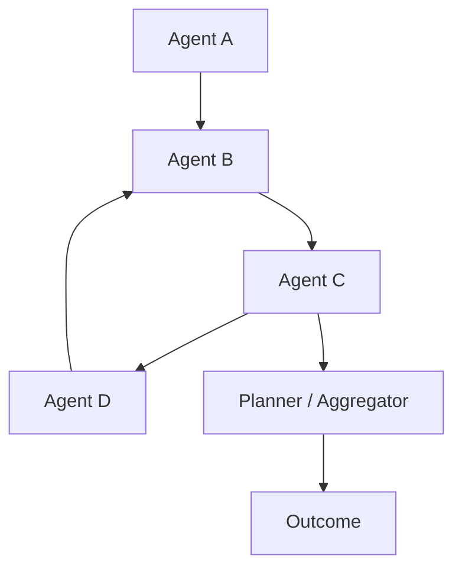
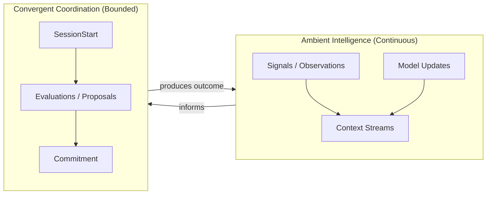
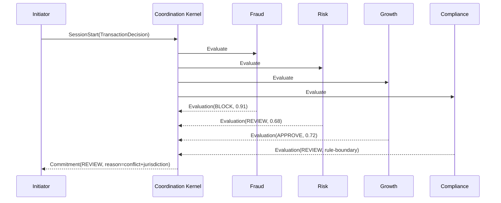
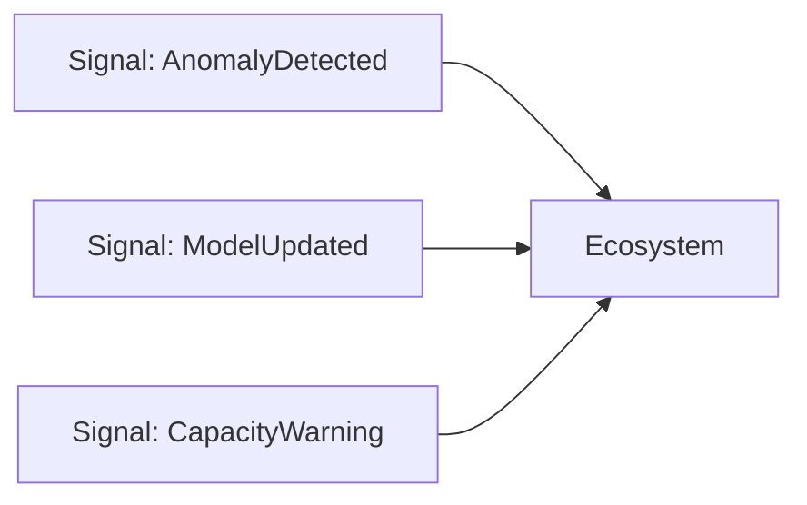

# The Coordination Age  
## As intelligence becomes abundant, coherence becomes the bottleneck—and coordination becomes the missing kernel.

*We’re past the question of whether models can reason. The live question is whether many reasoning entities can produce one coherent outcome on purpose, every time, under pressure. This is a proposal for the missing primitive: coordination as a first-class session with lifecycle, isolation, and replay.*

---

## The era after intelligence

We are entering a new era of artificial intelligence, and it is not the one most people think we are entering.

The first era was about intelligence itself. Could machines generate language? Could they reason? Could they retrieve knowledge, plan, and act? That era delivered breathtaking progress. Models became powerful. Agents emerged. Tools connected reasoning systems to the external world. Systems that once answered questions began executing tasks.

That era was about capability.

Capability made AI impressive; coherence will make it dependable.

As intelligence becomes abundant and agents multiply, the central challenge shifts. The problem is no longer whether a model can reason in isolation. The problem is whether many reasoning entities can converge into a single, stable outcome without dissolving into recursive instability.

The question is no longer about inference. It is about coordination.

---

## The hidden fragility beneath multi-agent systems

Today’s multi-agent systems are typically built on communication primitives. Agents call other agents. Planners aggregate responses. Supervisory layers override outputs. Retry logic smooths uncertainty. Messages flow constantly across the system. From the outside, it appears coordinated.

But beneath the surface, convergence is often implicit.

There is rarely a declared boundary where coordination begins. There is rarely a formal lifecycle that guarantees it ends. There is rarely a structural guarantee that two identical coordination processes will unfold identically. Decisions emerge from chains of interaction, not from architected convergence.

At small scale, this works. In prototypes and early deployments, engineers can reason locally about behavior. But as systems grow more autonomous and more interconnected, implicit coordination begins to resemble a living organism without a skeleton. Signals flow continuously. Agents adapt to one another. Outcomes emerge. Yet the structural integrity of convergence remains assumed rather than enforced.

Distributed computing encountered this problem decades ago. Early networked systems relied on optimistic assumptions about communication. Eventually, engineers discovered that communication alone could not guarantee consistency. Transactions, isolation boundaries, and consensus mechanisms became necessary—not because they were elegant abstractions, but because scale made implicit coordination unsustainable.

Artificial intelligence is approaching the same inflection point.

The prevailing shape looks like a mesh: signals and calls, some planned and many incidental, with loops that no one intended and dependencies that only reveal themselves under stress.

Signals circulate. Agents influence one another. A planner eventually emits an outcome. But where, exactly, did coordination happen? At what moment did convergence become binding? What bounded the interaction?

---

## A transaction at 2:13 a.m.

To see why this matters, imagine a modern digital bank operating in autonomous mode. It processes millions of decisions per hour. Inside its infrastructure operate specialized agents: a fraud agent analyzing behavioral anomalies, a growth agent modeling lifetime value, a compliance agent enforcing jurisdictional rules, a fairness agent auditing bias, a customer experience agent optimizing friction, and a supervisory agent monitoring confidence across the system.

These agents emit signals continuously. They observe, update, and refine. When a high-value international transaction arrives—a $48,000 transfer from São Paulo at 2:13 a.m.—each agent evaluates it from its own perspective.

Fraud risk shifts slightly due to an unusual login time. Growth signals argue for approval because the customer is historically valuable. Compliance verifies cross-border legality. Fairness confirms no discriminatory bias. Customer experience recommends minimizing friction.

In most current architectures, these agents communicate freely. One calls another. Thresholds adjust dynamically. Confidence scores influence subsequent evaluations. A planner aggregates probabilistic outputs. If signals conflict, a retry may occur. Eventually, a decision emerges—perhaps to allow the transaction but require step-up authentication.

The system works.

But where did convergence actually happen?

Did it occur when the planner combined scores? When the supervisory agent decided confidence was sufficient? When a timeout expired? If the same transaction were replayed tomorrow under slightly different timing conditions, would the interaction unfold identically? Or would subtle ordering shifts change weighting, explanation, or outcome?

The intelligence of the system is not in doubt. Its structure is.

When convergence is implicit, it becomes difficult to isolate. When something goes wrong—a legitimate transaction declined or a fraudulent one approved—engineers reconstruct a mesh of asynchronous interactions. They trace call graphs. They inspect dynamic weights. They attempt to reproduce timing. Yet the coordination event itself had no formal boundary. It existed as an emergent pattern of messaging.

That fragility compounds as ecosystems scale.

---

## Two temporal shapes of intelligence

Autonomous agent ecosystems exhibit two fundamentally different temporal patterns.

The first is continuous interaction. Agents emit observations. Models update. Context evolves. Signals propagate. There is no single terminal outcome. This is ambient intelligence—the ecosystem breathing.

The second is convergent coordination. Something must be decided. A resource must be allocated. A plan must be selected. An action must be taken. A commitment must be made. This is bounded resolution—the ecosystem acting.

Most current systems blur these two shapes. They treat continuous interaction and discrete convergence as variations of the same process. They are not.

A system that never converges cannot act. A system that converges without boundaries cannot be trusted.

What is missing is structural separation. The ambient flow of intelligence must remain continuous. But when convergence is required, it must occur inside an explicit boundary.

The ecosystem breathes continuously. But when it must act, it enters a different shape.

---

## The structural shift: coordination sessions

Now imagine the same banking ecosystem with one architectural change.

Ambient signals remain unchanged. Fraud updates stream continuously. Growth models adapt. Compliance rules evolve. Agents observe and learn. But when a binding decision must be produced, a coordination session is declared.

That session has an identity. It declares its participants. It specifies its mode of coordination. It has a bounded lifetime. It terminates explicitly.

Inside that boundary, convergence unfolds.

Agents no longer call one another directly inside the resolution loop. They contribute into a bounded context. The coordination mode applies arbitration semantics. A terminal commitment is emitted. The session ends.

Outside that session, signals continue to flow.

The ecosystem continues. But convergence is explicit.

What changes is not intelligence. It is coherence.

---

## Convergence is a phase change

The core insight is simple but profound: convergence is not just another message exchange.

It is a structural phase change in the system. Multiple autonomous perspectives collapse into a single binding outcome. Phase changes require boundaries.

Communication can remain ambient and continuous. Convergence must be bounded and explicit.

This creates a new architectural layer—a coordination kernel. It does not dictate semantics. It does not impose business logic. It ensures that when multiple agents must converge, that convergence occurs inside a defined session with lifecycle and isolation.

Inside that boundary, coordination modes can evolve freely. Weighted arbitration, consensus mechanisms, hierarchical delegation, economic bidding—these are semantic choices. The boundary remains stable.

The history of computing suggests that the most enduring abstractions are those that define boundaries without freezing behavior. Operating systems do not dictate what programs should do; they define how processes live and die. TCP does not dictate application semantics; it defines reliable transport. Container orchestration does not define business logic; it defines lifecycle and isolation.

A coordination kernel belongs in that lineage.

---

## Ownership is the real requirement

The deeper reason this matters is not elegance. It is ownership.

Imagine it is 2:17 a.m. A regulator calls. A major customer was blocked incorrectly. Or worse—a fraudulent transaction was approved. The question is simple: why did this happen?

In a mesh of implicit coordination, you reconstruct emergent behavior. Agent A influenced Agent B, which triggered a signal, which changed context, which Agent C observed, which caused a proposal, which modified weights mid-flight. Even if the explanation is correct, it is operationally fragile. You are describing weather.

In a bounded session model, you provide a session identifier. You show the participants. You show the immutable evaluations. You show the arbitration rule and its version. You replay the exact coordination context. You can defend the system not because it never fails, but because its convergence is structurally legible.

That difference is not philosophical. It is structural.

Autonomous systems that influence finance, healthcare, logistics, energy, or governance will not be judged only by their intelligence. They will be judged by their ability to explain convergence.

---

## The Coordination Age

The first era of AI asked whether machines could think. The era we are entering must ask whether machines can coordinate.

As agent ecosystems scale—thousands of agents, cross-domain reasoning, adaptive learning—the cost of unbounded coordination grows exponentially. Hidden dependencies compound. Recursive interaction loops proliferate. Decisions become emergent states rather than explicit events.

The systems that thrive in the coming decade will not merely be intelligent. They will be structurally coherent. They will treat convergence as a first-class primitive rather than an accidental byproduct of messaging. They will separate the continuous flow of ecosystem intelligence from the bounded events where the system commits to an outcome.

We are at the threshold of that shift.

The coordination layer is not an optimization.

It is the missing foundation.

And in the Coordination Age, coherence—not capability—will determine which autonomous systems endure.
